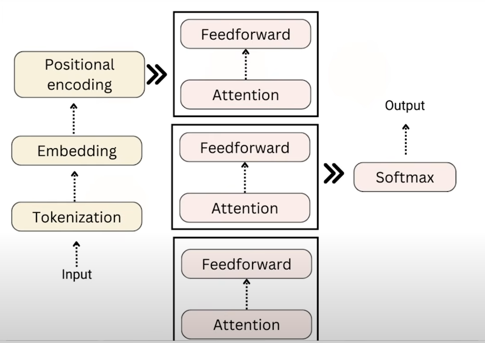

This repository explores the **Transformer architecture**, the foundation of modern Large Language Models (LLMs) like GPT, BERT, and others.

---

## 🚀 Transformer Architecture Overview

The Transformer is a neural network architecture introduced in *Attention Is All You Need (2017)*.  
It replaces recurrent models (RNNs, LSTMs) with **self-attention**, enabling models to capture long-range dependencies and scale efficiently.

### 🔹 Processing Pipeline

1. **Input → Tokenization**  
   - Raw text is split into tokens (words, subwords, or characters).  
   - Example: `"Transformers"` → `["Trans", "form", "ers"]`.

2. **Embedding**  
   - Tokens are mapped to high-dimensional vectors (dense representations).  
   - Embeddings capture semantic meaning (e.g., `"king"` ≈ `"queen"` more than `"apple"`).

3. **Positional Encoding**  
   - Since Transformers don’t have an inherent sense of order, positional encodings inject sequence order information.  
   - Ensures `"I love cats"` ≠ `"Cats love I"`.

4. **Transformer Blocks (Stacked)**  
   Each block has two key components:  
   - **Self-Attention (Multi-Head Attention):**  
     Every token looks at all others in the sequence and determines which ones are most relevant.  
     Example: In `"The cat sat on the mat"`, the word `"cat"` attends more to `"sat"` than `"mat"`.  

   - **Feedforward Network (MLP):**  
     A small neural network processes each token representation after attention to enrich contextual understanding.

   🔁 These blocks are stacked multiple times (e.g., 12 in BERT Base, 96 in GPT-4).

5. **Softmax (Output Layer)**  
   - Converts the final hidden states into probabilities over the vocabulary.  
   - Example: given `"I love"`, the model predicts the next word with probabilities:  
     - `"you"` → 0.7  
     - `"cats"` → 0.2  
     - `"pizza"` → 0.1  

---

## 📊 Diagram

Here’s the simplified flow (from the shared diagram):



```
Input → Tokenization → Embedding → Positional Encoding →
[ Attention → Feedforward ] × N → Softmax → Output
```
